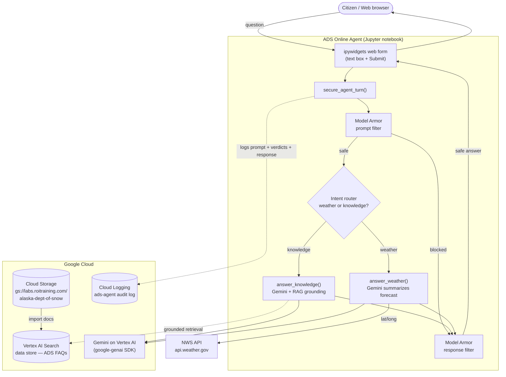

# Challenge 5 — ADS Online Agent: Architecture

Solution architecture for the Alaska Department of Snow (ADS) online agent. A citizen asks a
question through a web form; the agent screens it, answers it from the ADS knowledge base (RAG)
or live weather data, screens the answer, logs everything, and returns a grounded reply.

## Diagram

## Components

| Component | Service | Role |
|---|---|---|
| Web form | `ipywidgets` (in notebook) | "Deployed" UI — text box + Submit button |
| Orchestration | `secure_agent_turn()` | Filter → answer → filter → log pipeline |
| Prompt / response filtering | **Model Armor** (2 templates) | Blocks injection, jailbreaks, unsafe content |
| Knowledge answers | **Vertex AI Search** + Gemini | RAG grounded on ADS FAQ documents |
| Weather answers | **NWS API** + Gemini | Live forecasts via `api.weather.gov` |
| Knowledge source | **Cloud Storage** → data store | 50 ADS FAQ `.txt` docs imported in code |
| Audit log | **Cloud Logging** (`ads-agent`) | Records every prompt, filter verdict, and response |
| Generation | **Gemini** on Vertex AI | `gemini-2.5-flash` via the `google-genai` SDK |
| Quality | **Gen AI Evaluation Service** | Scores grounded answers (`EvalTask`) |

## Request flow

1. Citizen submits a question in the web form.
2. The prompt is **logged**, then screened by **Model Armor** (prompt template). If blocked, a safe
   refusal is returned.
3. An **intent router** decides whether the question is about weather or ADS knowledge.
   - **Knowledge** → Gemini answers, **grounded on the Vertex AI Search data store**.
   - **Weather** → the **NWS API** is called for the location, and Gemini summarizes the forecast.
4. The answer is screened by **Model Armor** (response template). If blocked, a safe refusal is
   returned.
5. The response is **logged** and shown to the citizen.
